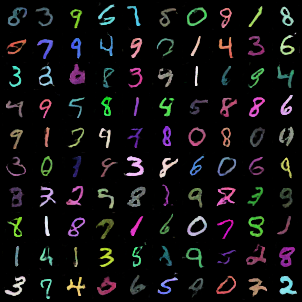
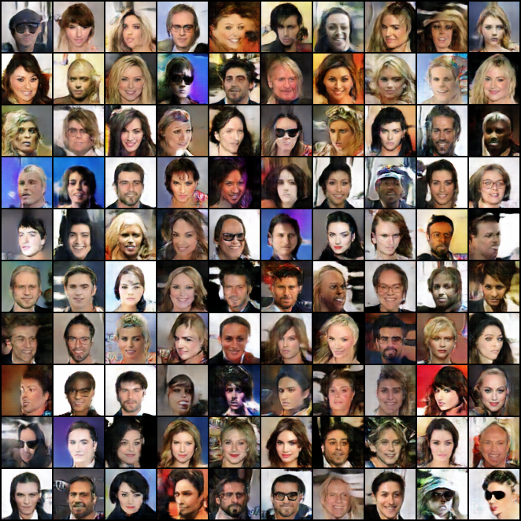

# DCGAN-Pytorch
A **complete PyTorch implementation of Deep Convolutional Generative Adversarial Networks (DCGAN)** trained on **MNIST** and **CelebA** datasets.  
This project demonstrates how GANs can learn complex data distributions and generate realistic images from random noise.


## Sample Output after training on MNIST



## Sample Output after training on CelebFaces Dataset


Research paper reference: https://arxiv.org/abs/1511.06434

## Data preparation
For setting up the mnist dataset:
Follow -[ https://github.com/explainingai-code/Pytorch-VAE#data-preparation](https://github.com/Abhaykum123/DCGAN-Pytorch/blob/main/dataset/mnist_dataset.py)

The directory structure should look like this
```
$REPO_ROOT
    -> data
        -> train
            -> images
                -> 0
                    *.png
                -> 1
                ...
                -> 9
                    *.png
        -> test
            -> images
                -> 0
                    *.png
                ...
    -> dataset
    -> tools
        
```
For setting up the celeb dataset:
* Simple Download the images from [here](https://mmlab.ie.cuhk.edu.hk/projects/CelebA.html) -> Downloads -> Align&Cropped Images
* Download the `img_align_celeba.zip` file from drive link
* Extract it under the root directory of the repo
* $REPO_ROOT -> Celebrity Faces Dataseta/*.jpg files
        

# Quickstart
* Create a new conda environment with python 3.8 then run below commands
* ```git clone https://github.com/Abhaykum123/DCGAN-Pytorch.git```
* ```cd DCGAN-Pytorch```
* ```pip install -r requirements.txt```
* ```python -m tools.train --config config/mnist.yaml``` for training and saving inference samples on mnist

## Configuration
* ```config/mnist.yaml``` -  For mnist
* ```config/mnist_colored.yaml``` -  For mnist colored images
* ```config/celeb.yaml``` -  For training on celeb dataset


## Output 
Outputs will be saved according to the configuration present in yaml files.

For every run a folder of ```task_name``` key in config will be created 
* Best Model checkpoints(discriminator and generator) in ```task_name``` directory
* Generated samples saved in ```task_name/samples``` 
